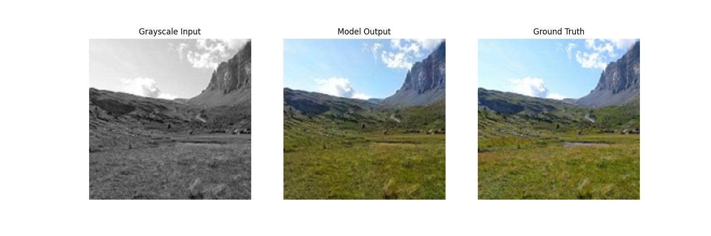
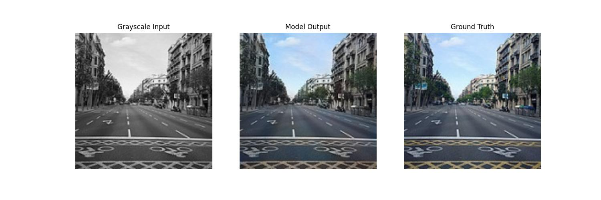
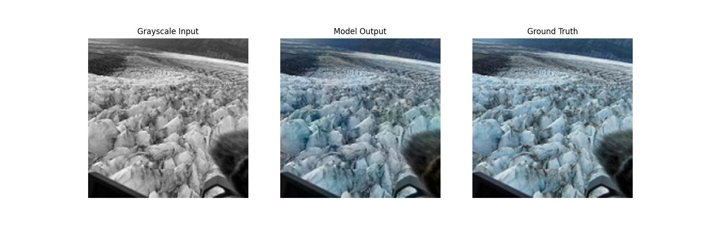
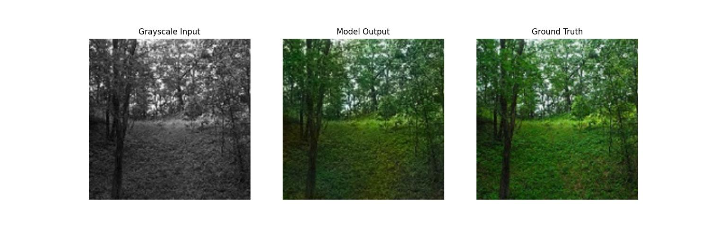
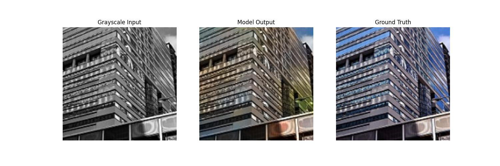

# Image Colorization using ResNet-152 and Transfer Learning

[](https://pytorch.org/) 
[](https://opensource.org/licenses/MIT)

This repository contains the official PyTorch implementation for the thesis: **"Application of Deep Learning Transfer Technique for Image Colorization Using ResNet-152 Architecture"** by Ankit Dhankhar.

The project demonstrates an automated learning-based method for colorizing grayscale images leveraging the deep, pre-trained **ResNet-152** architecture. The model is fine-tuned to predict the chrominance (`ab` channels) of an image based on its luminance (`L` channel) using the CIE LAB color space.

## Table of Contents
- [Background & Methodology](#background--methodology)
- [Performance](#performance)
- [Setup & Installation](#setup--installation)
- [Training the Model](#training-the-model)
- [Inference / Colorization](#inference--colorization)
- [Pre-trained Weights](#pre-trained-weights)

---

## Background & Methodology
Image colorization is an ill-posed problem where multiple color outputs can be correct for a single geographic grayscale pixel. This project tackles the problem using **Transfer Learning**:
1. **Model Modification**: The standard ResNet-152 architecture (originally designed for 3-channel RGB image classification on ImageNet) has its first convolutional layer adapted to accept single-channel (Grayscale/Luminance) input.
2. **Feature Extraction**: Mid-level representations are extracted from the first six layers (up to 512 channels) of ResNet-152.
3. **Colorization Network**: A custom fully convolutional network (5 layers) upsamples and predicts the `ab` chrominance parameters.
4. **Color Space**: Operations are performed inside the continuous `LAB` color space, enforcing spatial color coherence and yielding vibrant but realistic natural hues. Best optimization stability was achieved with `AdamW` and `CosineAnnealingLR`.

## Performance
- **Dataset**: Custom diverse dataset containing over 7,100 color-grayscale pairs (landscapes, streets, glaciers). 
- **Quantitative Result**: The model successfully achieves a Peak Signal-to-Noise Ratio **(PSNR) of 29.62 dB** on unseen test data, placing the visual quality firmly in the acceptable standard for high-quality predictive colorization.

### Visual Results
Below are 5 randomly sampled outputs generated by the 150-epoch weights on unseen test images. The model successfully predicts rich, coherent colors for skies, landscapes, and oceans based entirely on luminance:

  
  
  
  
  

---

## Setup & Installation

**Prerequisites:** 
- Python 3.8+
- Hardware: Natively supports NVIDIA GPUs (CUDA), standard CPUs, and Apple Silicon Macs (MPS).

1. **Clone the repository:**
   ```bash
   git clone https://github.com/dhankharAnkit/ResNet152-Colorization.git
   cd ResNet152-Colorization
   ```

2. **Install dependencies:**
   ```bash
   pip install -r requirements.txt
   ```

---

## Training the Model

To train the model from scratch (or fine-tune using ImageNet weights), you need to format your dataset. A standard folder is expected containing a `color/` subdirectory with RGB images. The grayscale values are algorithmically derived at runtime using data augmentations. 

```bash
# Example dataset structure:
# dataset/
# └── color/
#     ├── 1.jpg
#     ├── 2.jpg
#     └── ...

python train.py --data_dir ./dataset --save_dir ./checkpoints --epochs 150 --batch_size 16
```
*Note: For machines with limited RAM (e.g. 16GB Apple Silicon Macs), it is advised to drop `--batch_size` down to 8 or 4 to prevent memory swapping.*

The script natively handles mixed-precision training (FP16 via `GradScaler` on CUDA) to speed up iterations, and checkpoints will be saved as `.pth` models in the `save_dir`.

---

## Inference / Colorization

You can use the provided inference script to quickly colorize a single grayscale image or an entire directory of grayscale images.

```bash
# Single Image
python colorize.py --model_path checkpoints/colorization_model_best.pth \
                   --input path/to/black_and_white.jpg \
                   --output ./results

# Directory of Images
python colorize.py --model_path checkpoints/colorization_model_best.pth \
                   --input path/to/grayscale_folder/ \
                   --output ./results
```

## Pre-trained Weights

To quickly reproduce the results without re-training, download the official pre-trained `.pth` checkpoints from the **[GitHub Releases]()** page and save them in the `checkpoints/` directory.

> **Note to Researchers**: If using this code, please refer to the thesis methodology guidelines for further insights into network structure and loss selection.
